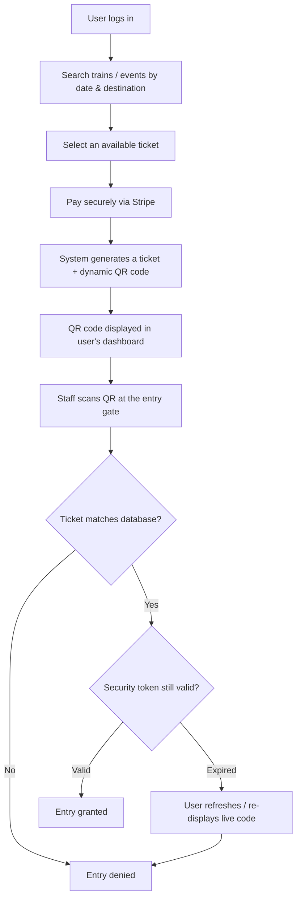
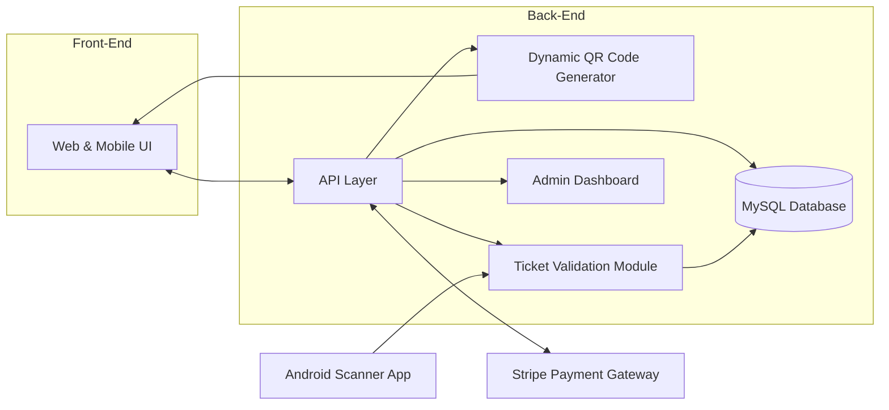
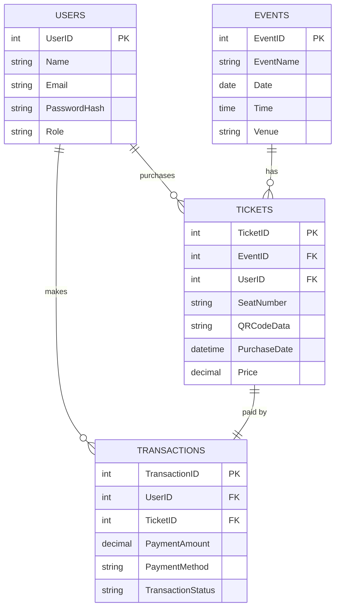

# 🎫 Chorolin — Anti-Black Ticket System

**Dynamic QR-code ticketing that makes scalped, screenshotted, or reprinted tickets unusable.**


## Table of Contents
- [Overview](#overview)
- [Key Features](#key-features)
- [How It Works](#how-it-works)
- [System Architecture](#system-architecture)
- [Tech Stack](#tech-stack)
- [Project Structure](#project-structure)
- [Getting Started](#getting-started)
- [Database Schema](#database-schema)
- [Security](#security)
- [Screenshots](#screenshots)
- [Evaluation Results](#evaluation-results)
- [Roadmap](#roadmap)
- [References](#references)
- [Contributing](#contributing)
- [License](#license)
- [Acknowledgments](#acknowledgments)

## Overview

Chorolin (research name: **Anti-Black Ticket System**) is a ticketing platform built to shut down the black market for event and transit tickets. Instead of a static QR code that can be screenshotted, printed, and resold, every ticket carries a security token that regenerates on a short timer, so a copy captured at any single moment stops working almost immediately.

The system pairs a **PHP/MySQL web application** — where users search, book, and pay for tickets — with a native **Android scanner app** that validates tickets against the database in real time at the point of entry.

Why it exists:
- Bots and scalping syndicates buy up tickets in bulk within seconds of release and resell them at inflated prices.
- Static QR codes and paper tickets are trivial to screenshot, print, and resell or counterfeit.
- Genuine, price-sensitive fans end up priced out or turned away with invalid tickets.

While the architecture generalizes to concerts, sports, and cinema ticketing, the reference implementation and screenshots in this repo model a **railway booking** use case (Bangladesh Railway routes and trains such as *Subarna Express* and *Ekota Express*).

## Key Features

- 🔐 Secure authentication with MFA support and bcrypt password hashing
- 🎫 Dynamic, single-use QR codes — the embedded security token refreshes automatically so screenshots or printouts stop working within seconds
- 📱 Native Android scanner app (ZXing + OkHttp) for real-time ticket validation at the gate
- 💳 Integrated Stripe payment gateway with PCI DSS-compliant card handling and built-in fraud monitoring
- 🗄️ Centralized MySQL database for users, events/trains, tickets, and transactions
- 🛠️ Admin dashboard for creating events/routes, managing pricing and inventory, issuing refunds, and monitoring sales in real time
- ↩️ Self-service ticket cancellation with automated refund processing
- 🚨 Anomaly detection to flag suspicious purchase or validation patterns (bulk buys, repeated resale attempts)
- 🔁 One-tap QR refresh from the user dashboard if a code expires before entry
- 🌐 RESTful API layer connecting the web frontend, admin tools, and mobile scanner

## How It Works



> **Note:** The source documentation isn't fully consistent on the QR refresh interval — the architecture and implementation sections describe the token refreshing **every 10 seconds**, while the introduction and conclusion describe **every minute**, with a stated goal to shorten it to 10 seconds. Confirm the actual value in your codebase and update this section to match.

## System Architecture



- **User Interface (Web & Mobile):** search, pay, and view/refresh a dynamic QR code.
- **Dynamic QR Code Generator:** issues a unique, encrypted QR payload per ticket (route/seat/ticket ID) and rotates its embedded security token.
- **Ticket Validation Module:** decrypts and checks each scanned code against the database in real time, rejecting expired or mismatched tickets.
- **Centralized Database (MySQL):** stores users, events/trains, tickets, and transactions with referential integrity.
- **Admin Dashboard:** event/route creation, pricing & inventory management, refunds, and live sales monitoring.
- **API Layer:** a RESTful layer connecting the web app, admin tools, and the Android scanner app to the backend.

## Tech Stack

| Layer | Technology | Version | Purpose |
|---|---|---|---|
| Web backend | PHP | 8.2.12 | Web logic & APIs |
| Database | MySQL / MariaDB | 10.4.32 | Data & log storage |
| Web server | Apache HTTP Server | – | Serves web requests |
| Frontend | HTML5, CSS3, JavaScript (Vanilla) | – | User interface |
| Payments | Stripe PHP SDK | v17.4 | Online payment processing |
| OCR | Tesseract (LSTM) | v5.0.1 | Text extraction from images |
| QR scanning | ZXing Android Embedded | v4.3.0 | Scan & verify QR codes |
| Networking (Android) | OkHttp | v4.9.3 | HTTP requests from the scanner app |
| Mobile scanner | Java (Android) | – | Native ticket scanner app |
| Version control | Git | – | Source control |

Technologies were chosen against six criteria: security, efficiency, scalability, cost-effectiveness, interoperability, and usability.

## Project Structure

_Adjust the tree below to match your actual repository layout — inferred from the technology stack and module descriptions in the project documentation._

```
.
├── backend/                # PHP web application & REST API
│   ├── api/                # API Layer endpoints
│   ├── config/              # DB & Stripe configuration
│   ├── includes/            # QR generation, validation, auth logic
│   └── public/               # Web-accessible entry point
├── android-scanner/         # Android ticket scanner app (Java, ZXing, OkHttp)
│   └── app/
├── database/
│   └── schema.sql            # Users, Events, Tickets, Transactions
├── docs/
│   └── screenshots/          # App screenshots referenced in this README
└── README.md
```

## Getting Started

### Prerequisites
- PHP ≥ 8.2
- MySQL or MariaDB ≥ 10.4
- Apache HTTP Server (or another PHP-compatible server)
- [Composer](https://getcomposer.org/) for PHP dependencies
- A [Stripe](https://stripe.com/) account (test/live API keys)
- Android Studio (to build/run the scanner app)
- Git

### 1. Clone the repository
```bash
git clone https://github.com/<your-username>/chorolin-anti-black-ticket-system.git
cd chorolin-anti-black-ticket-system
```

### 2. Install backend dependencies
```bash
cd backend            # adjust to your actual folder name
composer install      # installs the Stripe PHP SDK and other dependencies
```

### 3. Create the database
```bash
mysql -u root -p -e "CREATE DATABASE anti_black_ticket_system"
mysql -u root -p anti_black_ticket_system < ../database/schema.sql
```

### 4. Configure credentials
Add your database credentials and Stripe API keys to the app's configuration (e.g. a `.env` file or `config.php`, depending on how this codebase loads settings):
```env
DB_HOST=localhost
DB_NAME=anti_black_ticket_system
DB_USER=root
DB_PASSWORD=
STRIPE_SECRET_KEY=sk_test_xxxxxxxx
STRIPE_PUBLISHABLE_KEY=pk_test_xxxxxxxx
```

### 5. Serve the application
Point an Apache virtual host at the project's public directory, or use PHP's built-in server for local development:
```bash
php -S localhost:8000 -t public
```
Then open `http://localhost:8000` in your browser.

### 6. Build the Android scanner app
1. Open `android-scanner/` in Android Studio.
2. Update the API base URL in the app's config to point at your backend (e.g. `http://<your-server-ip>:8000/api`).
3. Sync Gradle, then build and run on a device or emulator with camera access.

## Database Schema



- **Users** — name, email, phone, bcrypt password hash, and role for access control.
- **Events** *(Trains, in the current implementation)* — name, number/category, and schedule.
- **Tickets** — ticket ID, linked event and user, seat/class, purchase timestamp, price, payment method, and the current QR code payload.
- **Transactions** — payment amount, method, and status, linked back to the originating ticket and user.

Admin accounts live inside the `Users` table and are distinguished by role rather than a separate table.

## Security

- **Authentication:** secure login with multi-factor authentication (MFA) support; passwords hashed with bcrypt.
- **Authorization:** role-based access control (RBAC) separates passenger and administrator capabilities.
- **Transport security:** traffic between the web app, API, and mobile scanner is encrypted with HTTPS/TLS.
- **Payment security:** card data is handled by Stripe (PCI DSS-compliant), with built-in transaction/fraud monitoring.
- **Session management:** secure cookies with session timeouts.
- **Fraud/anomaly detection:** flags irregular patterns such as bulk purchases or repeated resale/validation attempts.
- **Ticket integrity:** each QR payload is encrypted and time-boxed; duplicate or expired codes are rejected at validation.

## Screenshots

Add exported screenshots to `docs/screenshots/` using the filenames below and this table will render automatically (see Section 4.4 of the project report for the originals):

| Login | Book a Ticket | Ticket & QR Code | Scanner App |
|---|---|---|---|
|  |  |  |  |

## Evaluation Results

- **Fraud resistance:** Penetration testing and code/infrastructure review targeting the QR generation and encryption logic found no significant vulnerabilities; testers could not produce duplicate tickets that passed validation.
- **Speed:** Ticket purchase and QR validation times were both measured as faster than traditional, paper-based flows.
- **Usability:** Surveys and usability testing (task completion rate, error rate, time-on-task) rated the interface as more user-friendly than the baseline systems it was benchmarked against.
- **Cost:** Operational costs came in lower than paper-based ticketing due to reduced physical handling.
- **Test setup:** Evaluation combined simulated load-testing data, an anonymized small-scale pilot with a real event organizer, and open datasets (e.g. Kaggle) for scalability and security validation.

| Feature | Chorolin | Traditional Paper Tickets | Other Electronic Systems |
|---|---|---|---|
| Security | High | Low | Medium–High |
| Scalability | High | Low | Medium |
| Cost-effectiveness | High | Low | Medium |
| Fraud prevention | High | Low | Medium–High |
| Ticket purchase time | Fast | Slow | Medium–Fast |
| Ticket validation time | Fast | Slow | Medium–Fast |
| Data analytics | High | Low | Medium |
| Environmental impact | Low | High | Medium |
| Accessibility | High (with alternatives) | Low | Medium–High |
| Integration with other systems | High | Low | Medium |
| Counterfeit ticket risk | Very low | High | Low–Medium |
| Scalper resale risk | Very low | High | Medium |
| Payment options | Multiple (online) | Cash | Limited |

**Known limitations:** requires attendees to have a smartphone capable of displaying/scanning QR codes, and depends on a stable internet connection at the venue.

## Roadmap

- [ ] OCR-based National ID (NID) verification at signup (Tesseract) for stronger identity assurance
- [ ] Additional encryption layers and continuous security-threat monitoring
- [ ] Local payment gateway integration for the Bangladesh market
- [ ] Fully synchronized database between the web dashboard and the Android scanner app
- [ ] Expansion beyond rail into sports, cinema, and general event ticketing
- [ ] Scalability work: load balancing, distributed databases, and optional NoSQL (e.g. MongoDB) for high-volume logs/analytics

## References

1. Kazi, S., Bagasrawala, M., Shaikh, F., & Sayyed, A. *Smart E-Ticketing System for Public Transport Bus.*
2. Sankaranarayanan, S., & Hamilton, P. (2014). Mobile Enabled Bus Tracking and Ticketing System. *2014 2nd ICoICT*, 475–480.
3. Saudagar, M., Tupare, J., Tupe, A., & Mali, S. *Smart Public Transport Ticketing System Using QR Code Online Payment Method.*
4. Xu, G., Yang, H., Liu, W., & Shi, F. (2018). Itinerary choice and advance ticket booking for high-speed-railway network services. *Transportation Research Part C*, 95, 82–104.
5. IEEE (2015). Exploring ticketing approaches using mobile technologies: QR Codes, NFC and BLE. *2015 IEEE 18th ITSC*, 7–12.
6. Preece, J. D., & Easton, J. M. (2019). Blockchain Technology as a Mechanism for Digital Railway Ticketing. *2019 IEEE Big Data*, 2945–2950.
7. Vinodhkumar, S., Kumar, P., Khorakiwala, M. A., & Monisha, R. (2024). Intelligent Agent based Ticket Booking System. *2024 3rd ICAAIC*, 104–109.
8. Nair, A. M., Taunk, S., Reddy, P. G., & Sultana, H. P. (2019). Smart Metro Rail Ticketing System. *Procedia Computer Science*, 165, 435–441.
9. Handoyo, E., Arfan, M., Soetrisno, Y. A. A., Somantri, M., Sofwan, A., & Sinuraya, E. W. (2018). Ticketing Chatbot Service using Serverless NLP Technology. *2018 5th ICITACEE*, 325–330.
10. Leal, J., Couto, R., Costa, P. M., & Galvão, T. (2015). Exploring ticketing approaches using mobile technologies: QR Codes, NFC and BLE. *2015 IEEE 18th ITSC*, 7–12.

## Contributing

Contributions, issues, and feature requests are welcome.

1. Fork the repo
2. Create your feature branch (`git checkout -b feature/amazing-feature`)
3. Commit your changes (`git commit -m 'Add amazing feature'`)
4. Push to the branch (`git push origin feature/amazing-feature`)
5. Open a Pull Request

## License

No license has been specified yet. Consider adding an open-source license (e.g. MIT, Apache-2.0) via GitHub's *Add file → Create new file → LICENSE* flow, or state usage terms here if this is meant to stay closed/academic-only.

## Acknowledgments

Developed by **Mir Tasrif**. The design draws on prior research into QR-based, blockchain, biometric, and mobile ticketing systems — see [References](#references) for the full list.
